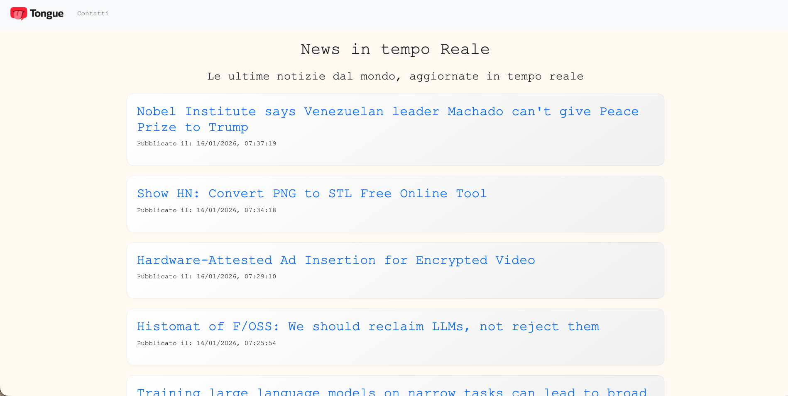

# 📰 App Tongue

## 📋 Descrizione

**Tongue** è una piattaforma di notizie internazionali aggiornata in tempo reale.

## 💡 Idea

I social media ormai fanno parte della vita quotidiana di una persona, **Tongue** nasce per trasformarli da intrattenimenti
ad informazione offrendo pillole di attualità immediate e accessibili provenienti da tutto il mondo.

## 💻 Funzionalità

* Notizie in tempo reale visualizzate in una dashboard semplice e intuitiva.
* Pulsante "Carica Più News" per caricare ulteriori notizie senza ricaricare la pagina Web.
* Dashboard usufruibile su tutti i dispositivi.

## 🔗 Vai al Sito

[Clicca qui per visitare **Tongue**]()  
Progetto caricato online con Netlify.  
Esame finale della sezione JS Advance di Start2Impact.  
Creazione di un App per la visualizzazione di notizie tramite API esterne.

### 📸 ScreenShot

1. Versione Desktop

2. Versione Mobile

## 🛠️ Tecnologie Usate

* HTML5
* CSS / SCSS
* JavaScript
* Bootstrap
* Webpack 
* API di Hacker News (per il caricamento degli articoli)

## Contatti

Christian Giaccardi - 📧 [chrigiaccardi@gmail.com](mailto:chrigiaccardi@gmail.com)  
GitHub - [chrigiaccardi](https://github.com/chrigiaccardi)  
LinkedIn - [LinkedIn](https://it.linkedin.com/in/christian-giaccardi-753085180?trk=public_profile_browsemap_profile-result-card_result-card_full-click)

